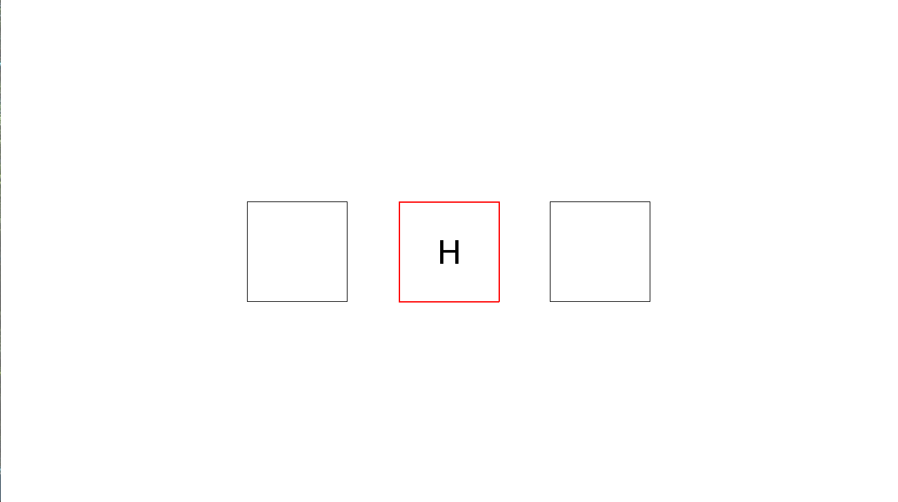

# Working Memory Removal
Implementation of a cognitive psychological experiment first used by Kessler & Meiran (2008) and refined by Ecker et al. (2018) to measure the update removal component of working memory (see pdf in master branch).
 
There are three separate versions of the experiment in this repository, using letters, digits, and words as stimuli. The task is conducted as follows: a starting sequence of three stimuli will be presented in the center of the screen for a specified interval. The sequence will disappear and be updated sequentially by a random new letter/digit/word which the participant will memorize, pressing a key to indicate successful encoding. Experimental conditions are differentiated by the cueing of the next square to be updated by a red box for half of the trials. At the end of each update block, participants are tested for the recall of the final sequence.

 
 
Kessler, Y., & Meiran, N. (2008). Two dissociable updating processes in working memory. Journal of Experimental Psychology: Learning, Memory, and Cognition, 34(6), 1339.

Singh, K. A., Gignac, G. E., Brydges, C. R., & Ecker, U. K. (2018). Working memory capacity mediates the relationship between removal and fluid intelligence. Journal of Memory and Language, 101, 18-36.
